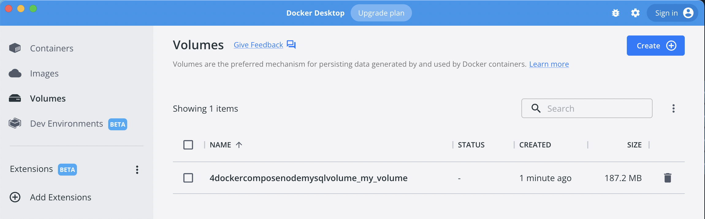

# docker-compose + node + mysql MVP
MVP of setting up nodejs + mysql using docker compose.  
Goes over core concepts like
- the need for manually wait & retry connecting to mysql in nodejs
- how to seed db using [./init/](./init/)

# Getting started
1. Start service.
```bash
# Clean previous containers, images and volumes
docker container prune && docker volume prune && docker image prune -a

# Install node_modules
cd app
npm install

# Start service
cd ..
docker-compose up
```

2. Wait a couple seconds for DB to be alive. Else the next step would not return any result.
```bash
# Or till you see this message in the terminal
my_node_app_1  | Success. Connected to db
```

3. Curl localhost:4000/ to `SELECT * FROM user`. It should return you an empty result.  
This is expected because we do not have any records in our db.
```bash
curl localhost:4000
{"success":true,"users":[]}
```

4. Curl localhost:4000/insert multiple times to insert dummy data into db.
```bash
# Insert multiple dummy data
curl localhost:4000
{"success":true,"user":{"name":"Sam 1661244758910","id":2172}}

curl localhost:4000
{"success":true,"user":{"name":"Sam 1661244760138","id":5999}}

curl localhost:4000
{"success":true,"user":{"name":"Sam 1661244759781","id":7408}}
```

5. Curl localhost:4000/ once more
This time, it should return non-empty results
```bash
curl localhost:4000
{"success":true,"users":[{"id":2172,"name":"Sam 1661244758910"},{"id":5999,"name":"Sam 1661244760138"},{"id":7408,"name":"Sam 1661244759781"}]}
```

6. Shut down docker, and delete container + image.  
IMPORTANT: Leave volumes untouched.
```bash
# Stop container
<Ctrl+C>

# Remove container & images
docker container prune && docker image prune

# Verify volume is still there
docker volume ls
```
7. (Optional) Can also verify volume is still present via docker UI  


8. Start server again
```bash
docker-compose up
```

9. Repeat step 5. You should get the same result. Without docker volume, you'll be getting an empty result, similar to step 3.

# Key concepts
1. How to link a volume in docker-compose?  
This diff contain the main highlights from [./docker-compose.yml](./docker-compose.yml)  
To verify this is volumes in action and not anything else, try removing these lines, and the volume (`docker volume prune`), and re-run the steps above.  
It will not work.
```diff
services:
  my_mysql_db:
    image: mysql:8.0
    command: --default-authentication-plugin=mysql_native_password
    environment:
      - MYSQL_DATABASE=learnDocker
      - MYSQL_USER=daniel
      - MYSQL_PASSWORD=123456
      - MYSQL_ROOT_PASSWORD=123456
    restart: always
    volumes:
      - ./init:/docker-entrypoint-initdb.d
+      - my_volume:/var/lib/mysql

  my_node_app:
    build: ./app
    ports:
      - "4000:4000"
    volumes:
      - ./app:/usr/src/app
    restart: always
    depends_on:
      - my_mysql_db

+ volumes:
+  my_volume:
+    driver: local

```

2. What is "data path"?  
At the end of the day, mysql db needs to write the data to somewhere in a disk, may it be virtual (docker) or physical (host). This is called a "data path"

3. Where is the data path for mysql in docker?  
Based on [here](https://hub.docker.com/_/mysql#:~:text=my/own/datadir%3A/-,var/lib/mysql,-%2De%20MYSQL_ROOT_PASSWORD%3Dmy), `/var/lib/mysql`.
To verify,
```bash
# List containers. There should be a couple, but we're interested in the mysql container
docker ps

# ssh into the mysql container
docker exec -it <container-id> /bin/bash

# cd to dir
cd /var/lib/mysql/learnDocker

ls
# You should see a user.ibd, which is the file describing the table "Users"
```